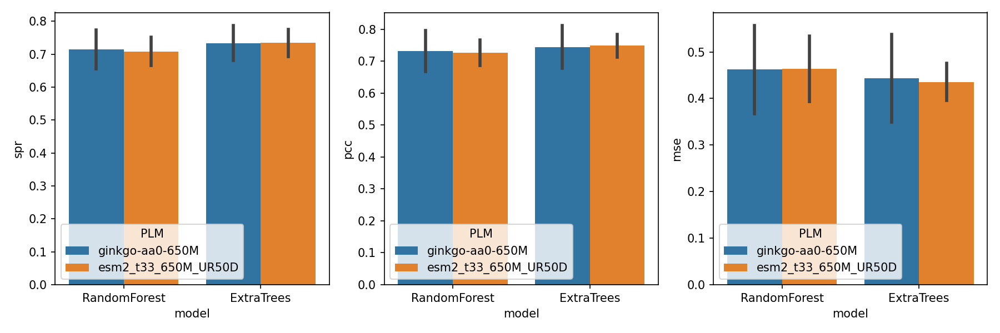

# elmsuite

[](https://github.com/psf/black)

Simple, unified interface to multiple evolutionary language models (Protein, DNA, and RNA).
This project is heavily inspired by [aisuite](https://github.com/andrewyng/aisuite).

## Installation

```shell
git clone https://github.com/JinyuanSun/elmsuite.git
cd elmsuite
pip install -r requirements.txt # will install all the dependencies
pip install -e .
```
## Set up

To get started, you will need API Keys for the providers of certain models you intend to use. 
Set the API keys.
```shell
export GINKGO_API_KEY="your-ginkgo-api-key"
export BIOLM_API_KEY="your-biolm-api-key"
```

## Basic Usage

### Get embeddings for protein sequences

1. Use the python client to compute protein sequnece embeddings.
```python
import elmsuite as elm
import numpy as np
interface = elm.Interface()
models = ["ginkgo:ginkgo-aa0-650M"]
sequence = "MTYKLILNGKTLKGETTTEAVDAATAEKVFKQYANDNGVDGEWTYDDATKTFTVTE"
results = interface.infer.embed.create(model=models[0], sequence=sequence)

embed = np.array(results.choices[0].embedding.content)
print(embed.shape)
```

2. Elmsuite also supports running inference locally.

```python
import elmsuite as elm
import numpy as np
interface = elm.Interface()
models = ["local:esm2_t33_650M_UR50D"]
sequence = "MTYKLILNGKTLKGETTTEAVDAATAEKVFKQYANDNGVDGEWTYDDATKTFTVTE"
results = interface.infer.embed.create(model=models[0], sequence=sequence)

embed = np.array(results.choices[0].embedding.content)
print(embed.shape)
# (1280,)
```

See [docs/examples.md](docs/examples.md) for more examples.

## AutoML with elmsuite

### AutoML for protein engineering
Training machine learning models with emlsuite is easy. 
```python
from elmsuite.automl import automl
# The wild-type sequence
wt_seq = "MTYKLILNGKTLKGETTTEAVDAATAEKVFKQYANDNGVDGEWTYDDATKTFTVTE" 
# The path to the CSV file containing the training data, see docs/automl.md for more information
fpath_csv = "examples/gb1/data.csv" 
# The machine learning models to train, supported models are:
#  - RandomForest
#  - ExtraTrees
#  - BayesianRidge
#  - GaussianProcessRegressor
ml_models = ['RandomForest', 'ExtraTrees'] 
# The protein language model to use for embedding the sequences
plm_model = "local:esm2_t33_650M_UR50D" 
# plm_model = "ginkgo:ginkgo-aa0-650M" # or use ginkgo model
# Run cross-validation to train the models
training, predictor = automl.auto_train(fpath_csv, wt_seq, plm_model, models=ml_models) 
# sequence of A26F mutation
mutant = "MTYKLILNGKTLKGETTTEAVDAATFEKVFKQYANDNGVDGEWTYDDATKTFTVTE" 
# Predict the fitness of the mutant by 5 fold cross-validation trained RandomForest model
prediction = predictor.predict(mutant, "RandomForest") 
```
With GB1 dataset, I compared the performance of Ginkgo's AA0-650M and ESM2 with the same size of the embedding. The results are shown below. The performance of AA0-650M and ESM2 are similar. ESM2 has a slightly smaller variance than AA0-650M in the five-fold cross-validation.

